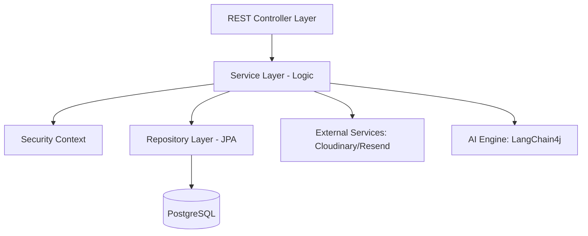

# AbogHub Backend Core (Legit API)

Legit es el motor robusto y escalable que impulsa el ecosistema de AbogHub. Diseñado bajo una arquitectura de micro-módulos en Spring Boot 3, este backend gestiona desde la autenticación stateless hasta servicios complejos de IA y gestión documental.

---

## 🏗️ Arquitectura del Sistema

El backend está organizado en módulos funcionales, cada uno con su propio dominio, controladores y lógica de negocio, lo que permite una mantenibilidad superior.

### Diagrama de Capas


### Módulos Principales
| Módulo | Descripción | Tecnologías Clave |
| :--- | :--- | :--- |
| **Identity** | Auth, RBAC, JWT, KYC y registro de usuarios. | Spring Security, JJWT |
| **Marketplace** | Perfiles de abogados, búsqueda avanzada y ratings. | Hibernate Search |
| **Matter** | Gestión de expedientes (casos), eventos y tareas. | JPA, Flyway |
| **Document** | Almacenamiento, streaming y control de acceso. | Cloudinary API |
| **AI** | Asistente legal, análisis de docs y RAG. | LangChain4j, OpenAI |
| **Appointment** | Gestión de agenda y notificaciones de reuniones. | Date-fns logic |
| **Chat** | Mensajería en tiempo real abogado-cliente. | WebSockets, STOMP |
| **Payment** | Integración de cobros y facturación. | Gateways Externos |

---

## 🛠️ Stack Tecnológico Detallado

- **Lenguaje**: Java 21 (LTS)
- **Framework**: Spring Boot 3.5.11
- **Base de Datos**: PostgreSQL 16 + Extension `vector`.
- **Seguridad**: JWT Stateless con renovación de tokens.
- **Gestión Documental**: OpenHTMLtoPDF para generación de contratos y actas.
- **IA**: Implementación de **RAG (Retrieval-Augmented Generation)** usando PgVector para embeddings de documentos legales.
- **Monitorización**: Spring Boot Actuator para health checks.

---

## 🔧 Configuración del Entorno

El proyecto requiere las siguientes variables de entorno (definidas en `.env` o variables de sistema):

### Base de Datos
- `DB_URL`: URL JDBC (ej: `jdbc:postgresql://localhost:5432/legit`)
- `DB_USER`: Usuario de la base de datos.
- `DB_PASSWORD`: Credenciales de acceso.

### Integraciones Críticas
- `JWT_SECRET_PROD`: Seed para el algoritmo HMAC-512 de los tokens.
- `RESEND_API_KEY_PROD`: API Key para notificaciones transaccionales.
- `CLOUDINARY_URL`: Configuración unificada de almacenamiento cloud.
- `GROQ_API_KEY`: Para procesamiento de lenguaje natural de alta velocidad.

---

## 🐳 Despliegue con Docker

El proyecto está preparado para ser "dockerizado" inmediatamente:

1. **Construir la imagen**:
   ```bash
   docker build -t saas-legit-backend .
   ```
2. **Levantar con Docker Compose** (incluye DB y App):
   ```bash
   docker-compose up -d
   ```

---

## 🛡️ Estándares de Seguridad

- **RBAC**: Control de acceso basado en roles (`CLIENT`, `LAWYER`, `ADMIN`).
- **CORS**: Política restrictiva configurada en `CorsConfig.java`.
- **Validación**: Sanitización estricta de entradas mediante `spring-boot-starter-validation`.
- **Auditoría**: Registro automático de acciones sensibles mediante el módulo `audit`.

---

## 📈 Roadmap de Desarrollo

- [x] Integración de IA para análisis de documentos.
- [x] Motor de citas con detección de choques horaria.
- [ ] Integración de firma electrónica (e-signature).
- [ ] Dashboard avanzado de analíticas para administradores.

---

## 👨‍💻 Contribución y Buenas Prácticas

- **Checkstyle**: Se recomienda seguir los estándares de Google Java Style.
- **Lombok**: Uso obligatorio para reducir el boilerplate.
- **Migrations**: Nunca modificar esquemas manualmente; usar archivos Flyway en `src/main/resources/db/migration`.
